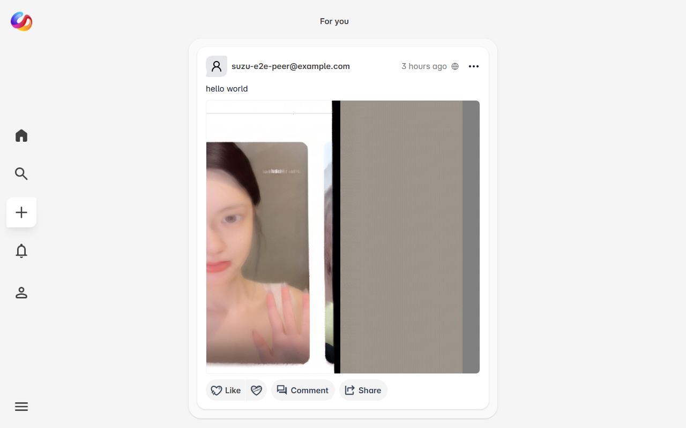
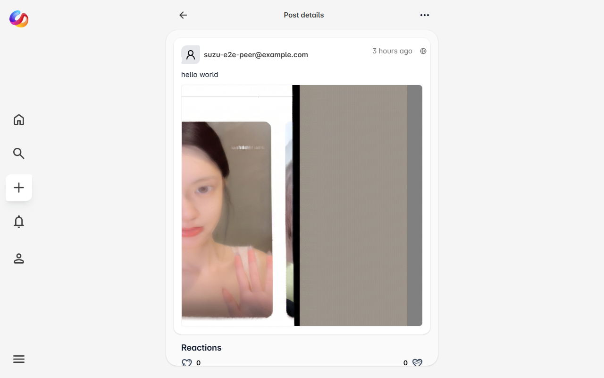
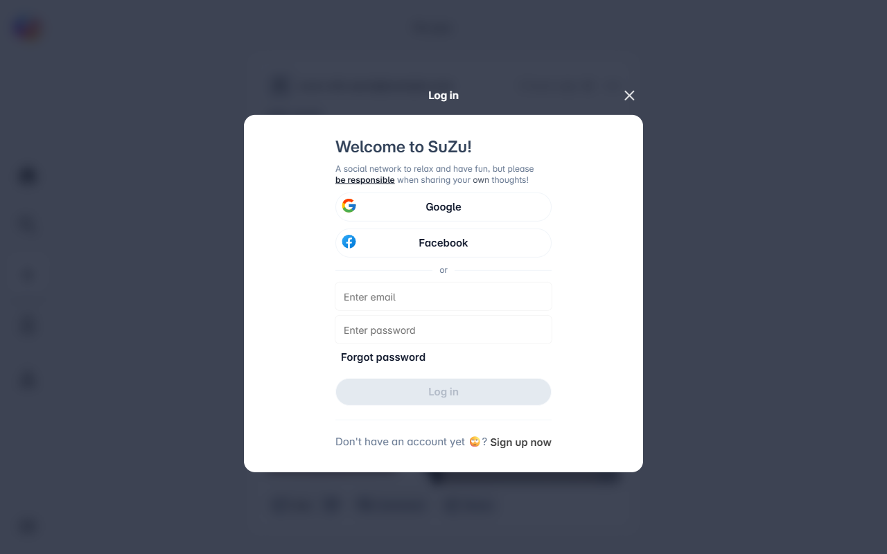

# Suzu Social Clone

A social networking app built with **Next.js 16**, **React 19**, Supabase and Turborepo. The monorepo holds the main app, a shared UI library, transactional email templates and shared tooling configs.

**Live demo:** [https://social-clone-supabase.vercel.app](https://social-clone-supabase.vercel.app)

## 📸 Screenshots

| Home feed | Post detail | Sign in |
|-----------|-------------|---------|
|  |  |  |

## 🌟 Highlights

- Supabase Auth (email/password and Google OAuth) with cookie-based sessions via `@supabase/ssr`.
- Posts, nested comments, reactions, saved posts, follows and realtime notifications, all protected by Row Level Security.
- Moderation and privacy: hide posts, block and report users, per-user privacy settings and post audiences enforced in the database.
- Rich text with TipTap 3, image uploads to Supabase Storage, YouTube embeds and link previews.
- Turborepo monorepo with a shared Radix-based UI package, React Email templates and Playwright end-to-end tests.

## ✨ Features

- **Feeds**: create, edit, delete and pin posts written in a TipTap 3 editor. Posts can include images (Supabase Storage), embedded YouTube videos (paste a link) and link previews (Open Graph, fetched server-side with SSRF protection). Post HTML is sanitized on write and on render.
- **Comments**: nested replies (replies to replies are grouped under their top-level comment), with reactions.
- **Reactions**: like / dislike on feeds and comments, updated live over Supabase Realtime.
- **Collections**: save a post, or remove it from your saved posts. Saved posts show on your own profile ("Saved" tab) and are private to you.
- **Follows**: follow / unfollow users, with follow suggestions based on users' post counts.
- **Notifications**: comments, reactions, new followers and new posts from people you follow. Postgres triggers create the rows; Supabase Realtime updates the unread badge and the list live.
- **Search**: matches post content and author display name / username.
- **Post audience**: pick **Public**, **Followers** or **Only me** in the composer (preselected from your privacy settings). Each post shows its audience icon next to the timestamp.
- **Hide posts**: "Hide post" in a post's menu hides it for you only (home feed, profiles and search), with Undo. The post page offers "Unhide".
- **Block users**: from a post menu or a profile's menu. Blocking removes follows both ways and hides posts, comments, reactions and notifications between you. Blocked users can't follow you, comment on or react to your posts. Manage them in **Settings → Blocked users**.
- **Report**: report a post, comment or user with a reason and optional details. Each user can report the same target once.
- **Privacy settings** (**Settings → Privacy**): default audience for new posts, who can see your posts (everyone / followers only) and who can comment (everyone / followers / no one). These rules are enforced by RLS, not only in the UI.
- **Profiles**: public pages at `/u/<username>`, or `/u/<user id>` before a username is chosen. Includes avatar upload, profile editing, change password, language preference (English by default), and a support/report form.
- **Auth**: Supabase Auth with email/password and OAuth (Google, Facebook), using `@supabase/ssr` cookie sessions refreshed in `src/proxy.ts`. `/settings/**` and `/notifications` require a signed-in user.

## 🏗 Project Structure

This project uses [Turborepo](https://turborepo.com) with pnpm workspaces.

| Path | What |
| --- | --- |
| [apps/supabase](apps/supabase) | Main Next.js 16 App Router app: UI, server actions, route handlers, `proxy.ts` session refresh, Playwright E2E tests |
| [packages/ui](packages/ui) | Shared UI components (Radix UI, Tailwind CSS 4, sonner, vaul) |
| [packages/transactional](packages/transactional) | Transactional email templates ([React Email](https://react.email/) 6) |
| [tooling/eslint-config](tooling/eslint-config) | Shared ESLint 10 flat configs |
| [tooling/tailwind-config](tooling/tailwind-config) | Shared Tailwind preset (JS config loaded through `@config`) |
| [tooling/typescript-config](tooling/typescript-config) | Shared `tsconfig` bases |
| [supabase/migrations](supabase/migrations) | Database schema (Supabase CLI migrations) |

### Tech stack (versions as of 2026-09)

| Area | Version |
| --- | --- |
| Next.js / React | 16.3.6 / 19.3.0 (webpack builder, `proxy.ts`, async request APIs) |
| Supabase | `@supabase/supabase-js` 2.117.1, `@supabase/ssr` 0.12.7 (`getAll`/`setAll` cookies, `getClaims()` in the proxy) |
| Styling | Tailwind CSS 4.3.3 (`@tailwindcss/postcss`), Radix UI primitives (latest), lucide-react 1.x |
| Editor | TipTap 3.31.3 |
| Email | React Email 6.11 (`react-email`) |
| Tooling | TypeScript 6.0.3, ESLint 10.11 (flat config), Turborepo 2.11.3, Prettier 3.9, Playwright 1.63 |

> TypeScript 7 (the native compiler) is out, but it is not used here yet: `typescript-eslint` supports `<6.1`, and TypeScript 7 does not ship the JavaScript compiler API that Next.js type-checking relies on.

## 🚀 Getting Started

### Prerequisites

- **Node.js** >= 20 (tested on Node 24)
- **pnpm** 10.x (`corepack enable` or `npm i -g pnpm`)
- **Supabase CLI** >= 2.x, for migrations and type generation
- **Docker**, only if you want a local Supabase stack

### Install

```bash
git clone https://github.com/tanthuqb/social-clone.git
cd social-clone
pnpm install
```

### Environment

```bash
cp apps/supabase/.env.example apps/supabase/.env.local
```

| Variable | Required | Description |
| --- | --- | --- |
| `NEXT_PUBLIC_SUPABASE_URL` | yes | Supabase project URL (keep the trailing `/`) |
| `NEXT_PUBLIC_SUPABASE_ANON_KEY` | yes | Anon / publishable key (browser-safe; RLS protects data) |
| `SUPABASE_PROJECT_ID` | no | Project ref, for CLI helpers |
| `NEXT_PUBLIC_APP_NAME` | no | App name used in metadata |
| `NEXT_PUBLIC_SITE_URL` | no | Absolute site URL for Open Graph metadata (falls back to `VERCEL_URL`, then `http://localhost:$PORT`) |
| `GA_MEASUREMENT_ID` | no | Google Analytics; scripts are only added when set |
| `E2E_USER_EMAIL` / `E2E_USER_PASSWORD` | tests only | Dedicated, confirmed test account for authenticated Playwright specs |

OAuth providers (Google, Facebook) are configured in the Supabase dashboard under **Authentication → Providers**. Add `http(s)://<your-host>/api/auth/callback` to the Auth **Redirect URLs**, plus `/api/auth/emailcallback` and `/api/auth/passwordcallback`.

The app never uses a service-role key; every query runs as the signed-in user (or anon) under RLS.

### Run

```bash
pnpm dev            # http://localhost:3000
```

## 🛠 Commands

| Command | What it does |
| --- | --- |
| `pnpm dev` | Start the dev server(s) |
| `pnpm build` | Production build of all packages (`next build --webpack` for the app) |
| `pnpm lint` | ESLint 10 (flat config) in every package |
| `pnpm check-types` | `next typegen && tsc --noEmit` in the app, plus `tsc --noEmit` in the packages |
| `pnpm test:e2e` | Playwright end-to-end tests (starts the app on port **3104**) |
| `pnpm format` | Prettier |

### End-to-end tests

```bash
cd apps/supabase
pnpm test:e2e:install        # once: downloads Chromium
pnpm test:e2e                # or from the repo root: pnpm test:e2e
```

- `playwright.config.ts` starts `next dev --webpack --port 3104` and reuses a server that is already running there. Tests run against `http://localhost:3104`, using the Supabase project from `apps/supabase/.env.local`.
- **Guest specs** (`e2e/guest.spec.ts`) cover:
  - the home feed
  - the login modal and its validation errors
  - 404 pages for unknown routes, profiles and posts
  - the settings login guard (including privacy and blocked users)
  - the audience icon on posts, and the login prompt for hide / block / report (skipped when the feed is empty)
  - public profile and post pages, using URLs found in the live feed (skipped when the feed is empty)
- **Authenticated specs** (`e2e/authenticated.spec.ts`) cover:
  - creating a post, commenting and reacting
  - saving a post to your collection and removing it
  - following and unfollowing
  - editing the profile bio
  - privacy settings (saved, reloaded, preselected in the composer) and an "Only me" post
  - hiding a post with Undo, then unhiding it from the post page
  - reporting a post (a second report is rejected)
  - blocking a user, the Blocked users list, and unblocking (the follow state is restored)
- The hide / block / report / privacy specs skip themselves until migration `20260925100000` is applied (the app then answers "unavailable until the database is updated").
- The authenticated specs need `E2E_USER_EMAIL` and `E2E_USER_PASSWORD`, and are **skipped with a message** when those are not set. Every spec that creates data cleans it up: the post and its comments are deleted, the reaction, save and follow are toggled back, and the bio is restored.
- Reports are written to `apps/supabase/playwright-report/` (git-ignored).

## 📦 Database & Migrations

The schema lives in [supabase/migrations](supabase/migrations) (Supabase CLI).

```bash
supabase link --project-ref <your-project-ref>   # once
supabase migration list --linked                 # what is applied
supabase db push --linked                        # apply pending migrations
supabase gen types typescript --linked > apps/supabase/src/lib/supabase/database.types.ts
```

> `database.types.ts` ends with hand-written app enums (`FeedPrivacy`, `ReactionState`, …). Keep or re-append that section after regenerating.

| Migration | Purpose |
| --- | --- |
| `20251217134658_remote_schema.sql` | Baseline schema pulled from the original project |
| `20260804150908_add_feed_collections_and_comment_engagement.sql` | `feed_collections` + `comment_engagement` tables with RLS |
| `20260804154419_enable_rls_legacy_tables.sql` | RLS + owner policies on all legacy tables |
| `20260804154903_harden_function_security.sql` | Revoke RPC access to trigger/internal functions, pin `search_path` |
| `20260805090000_enable_realtime_publication.sql` | Add app tables to `supabase_realtime` |
| `20260924120000_rls_hardening_storage_and_integrity.sql` | Covers: feeds privacy-aware SELECT; saved posts private and deduplicated (unique `(user_id, feed_id)`); reports owned by `user_id`; no self-follows; content limit moved to HTML (5000, plain text is capped at 300 by the app); OAuth sign-up no longer fails on duplicate names; owner-only Storage policies and bucket creation |
| `20260925100000_hide_block_report_privacy.sql` | `hidden_feeds` and `user_blocks` tables; privacy columns on `profiles` (`default_post_privacy`, `profile_visibility`, `comment_permission`); report targets (`feed_id` / `reported_user_id`), `reason` and one report per user and target; RLS enforcing blocks, hidden posts, followers-only profiles and comment permissions; no notifications between blocked users. Helpers live in the non-exposed `private` schema |

### Schema overview

| Table | Purpose |
| --- | --- |
| `profiles` | User profiles (1-1 with `auth.users`); `full_name` is the unique username; privacy settings |
| `feeds` | Posts **and comments** (`type = 'feed' / 'comment'`, nesting via `parent_id`), pinning, privacy & status enums |
| `feed_images` / `feed_medias` | Post attachments |
| `feed_engagement` | Reactions on posts and comments |
| `comments` / `comment_engagement` | Legacy tables (not used by the UI; comments are rows in `feeds`) |
| `feed_collections` | Saved posts |
| `user_follows` | Follow relationships |
| `notifications` | Created by Postgres triggers; `status` = seen (badge), `read` = opened |
| `report` | Support messages and reports of posts, comments or users (`reason`, one per user and target) |
| `hidden_feeds` | Posts a user hid (per user) |
| `user_blocks` | Blocks (`blocker_id` → `blocked_id`); visible to both users, removable by the blocker |

**Storage buckets**: `avatars` (profile pictures) and `suzu` (post images). Both are public-read. Once the 2026-09 migration is applied, uploads go to `<user_id>/<file>` and only the owner can change or delete them.

**Security:** RLS is enabled on every `public` table. Content is publicly readable (respecting `feeds.privacy`), and writes are restricted to the owner. Notifications and saved posts are private. After `20260925100000`, the feeds policy also hides posts from followers-only profiles (for non-followers), posts the viewer hid, and anything between blocked users; comment, reaction and follow inserts are checked against blocks and the author's comment setting.

**Before `20260925100000` is applied** the app keeps working: queries on the missing tables/columns are treated as "nothing hidden, nobody blocked, default privacy", the privacy and blocked-users pages show a notice, and hide / block / report / privacy actions return "This feature is unavailable until the database is updated." The post audience picker works either way (`feeds.privacy` already exists).

`src/lib/db/schema` holds **Zod** schemas and app enums used for input validation. Drizzle ORM is no longer a dependency; the database's source of truth is the migrations folder.

## ▲ Deploying to Vercel

1. Import the repository into [Vercel](https://vercel.com/new) and set **Root Directory** to `apps/supabase`.
2. Add the environment variables above.
3. Apply the migrations (`supabase db push --linked`) and add the Vercel domain's callback URLs to the Supabase Auth redirect allow-list.

## ✉️ Emails

```bash
cd packages/transactional
pnpm dev      # preview server on http://localhost:3010
pnpm export   # render templates to ./out
```
